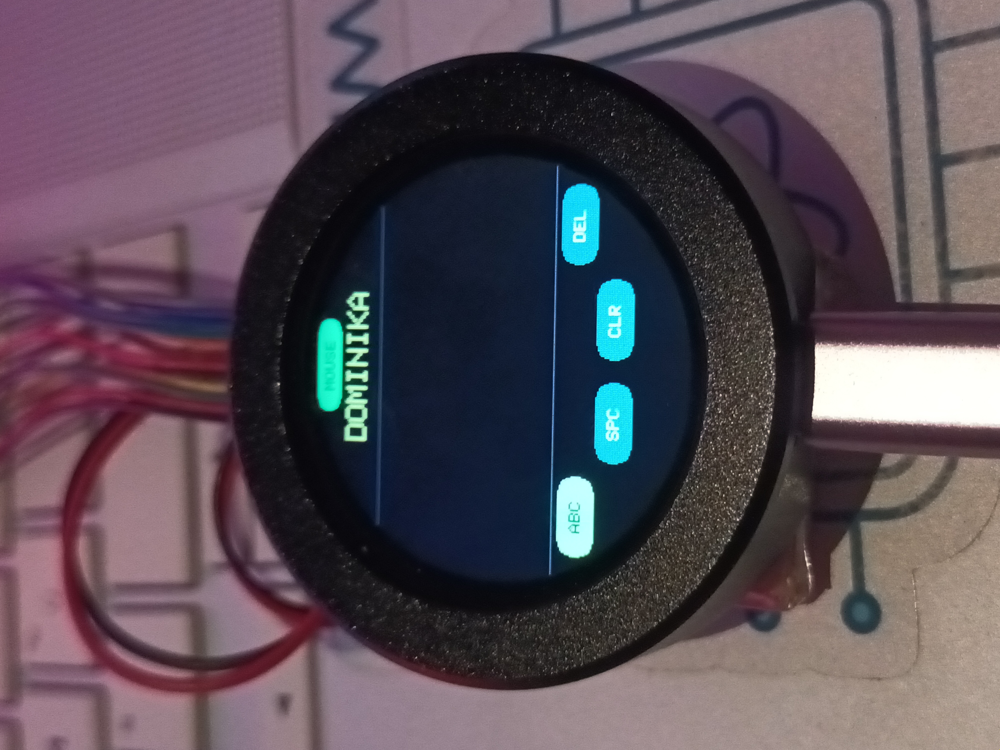
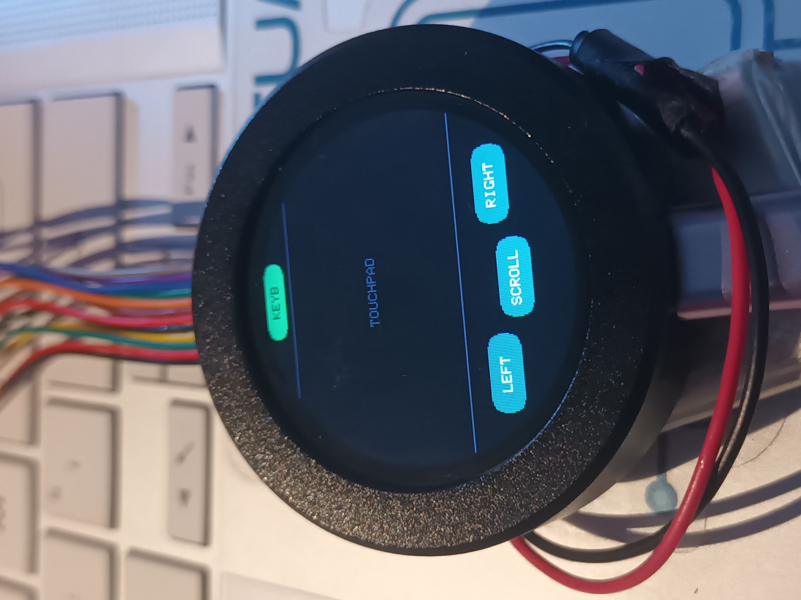

# RP2350 Touch Keyboard & Touchpad

A handwriting USB keyboard and mouse touchpad running on the  board (1.28" round touch display, 240×240, GC9A01A +
CST816S). Draw a letter or digit on the screen with your finger, a neural
network recognizes it and sends it to your computer as a real key press.
A second screen turns the display into a touchpad with a scroll wheel.
Everything runs in MicroPython directly on the RP2350 — no PC-side frameworks.





## Features

- **Handwriting recognition** — MLP 784→192→47 trained on EMNIST Balanced
  (letters A–Z + digits 0–9), fully int8 inference via `@micropython.viper`,
  ~100 ms per character, ~85 % accuracy
- **USB HID composite** — the board enumerates as a keyboard, a mouse and a
  serial port at once (REPL/Thonny keeps working); switching screens is
  instant, with no USB re-enumeration
- **Touchpad** — cursor movement, tap to click, laptop-style tap-drag,
  LEFT/RIGHT buttons and a SCROLL mode (wheel)
- **ALL / ABC / 123 modes** — restricting the class set resolves the
  inherently ambiguous pairs 0↔O and 1↔I
- UI layout computed for the round display (buttons along the bottom arc),
  fatal errors are printed directly on the screen

## Hardware

| | |
|---|---|
| Board | Waveshare RP2350-Touch-LCD-1.28 |
| Display | 1.28" round IPS 240×240, GC9A01A controller (SPI) |
| Touch | CST816S (I2C1: SDA=GP6, SCL=GP7) |
| Firmware | MicroPython for RP2350 from the Waveshare wiki (`.uf2`) |

## Installation

1. **Firmware:** flash the MicroPython `.uf2` provided by Waveshare
   (hold BOOT + plug in USB).
2. **USB libraries:** upload the contents of `usb_keyboard_lib.zip` to `/lib`
   on the board, resulting in `/lib/usb/device/{__init__,core,hid,keyboard}.py`
   (files come from [micropython-lib](https://github.com/micropython/micropython-lib), MIT).
3. **Model:** on your PC run `python train_emnist_balanced.py`
   (only `pip install numpy` needed; the ~33 MB dataset downloads
   automatically). This produces `emnist_w.bin` (~157 kB).
4. **Upload:** copy `main.py` and `emnist_w.bin` to the root of the board's
   flash (e.g. via Thonny), reset — done.

## Usage

- Draw a character in the middle area; ~0.7 s after lifting your finger it is
  recognized and typed into the PC (multi-stroke characters are fine, the
  timer resets while you draw).
- Keyboard: **ABC/123** · **SPC** · **CLR** · **DEL** along the bottom arc.
- The green button at the top switches **keyboard ↔ touchpad**;
  grey = USB not connected.
- Touchpad: **LEFT** · **SCROLL** · **RIGHT**; tap = click, double-tap
  and drag = drag & drop.

## Configuration (in `main.py`)

```python
HOST_QWERTZ = False   # True for Czech/QWERTZ host layout (Y/Z swap, digits via numpad)
PAD_SPEED   = 1.7     # cursor sensitivity (2x faster = 3.4)
SCROLL_DIV  = 10      # px of drag per wheel step (smaller = faster)
IDLE_MS     = 700     # idle delay before a character is recognized
```

## Files

| File | Purpose |
|---|---|
| `main.py` | on-device app (LCD, touch, network, USB HID, both screens) |
| `train_emnist_balanced.py` | training + int8 weight export (runs on a PC) |
| `usb_keyboard_lib.zip` | USB device libraries from micropython-lib for `/lib` |
| `emnist_w.bin` | model weights (generated by the training script) |
